# 第一章 概论
## 基本概念和术语
1. 机器学习是基于数据或以往的经验，学习并优化具体算法的性能.
2. 数据集
   1. $D = \{(x_i,y_i) | i \in \{1,2,...,n\}\}$
   其中，$D$是数据集，$x_i$是数据，例如图像，一句话等；$y_i$是groud_truth.
   2. 训练数据:Training Data,拥有$y_i$真实值，用于训练参数,让$\hat{y}$尽可能接近$y_{truth}$
   3. 测试数据：用于测试模型性能。若存在真实值，则可以计算性能指标(损失率等)，也称为验证集Validation；若不存在真实值，则为测试集。
3. 特征：数据$x_i$经过处理后得到的可判别的信息，丢弃噪声和无关信息。
4. 模型：
   1. $\hat{y} = g_{\theta}(x_i)$，是机器学习算法学习到的规律，将输入和输出之间建立了一个联系。
   2. 模型建立目标是最小化损失函数。损失函数有：
    >均方误差损失（单分类，回归任务等）：MSE Loss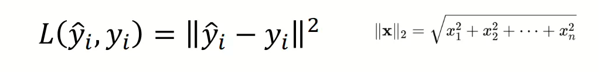
    > 交叉熵损失：Cross entropy Loss: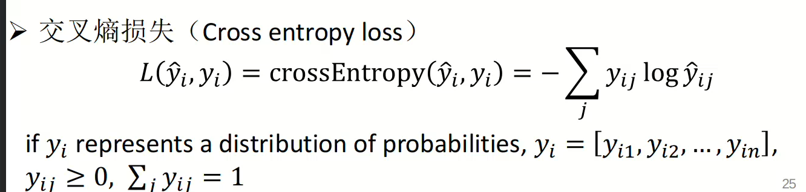

    3. 目标：最小化损失函数。优化方法：解析解、梯度下降、随机梯度下降、牛顿法、 拟牛顿法(BFGS)、有限内存BFGS (L-BFGS)、共轭梯度法‘
 5. 假设：具有未知参数（或模型）的一个数学模型，用于构建输入输出的关系$\hat{y_i} = g_{\theta}(x)$
 6. 学习：根据训练数据来调整模型参数获得的最佳*假设*，使得模型可以准确预测新数据。
 7. 决策：学习后，模型根据新的数据$x_j$来预测出结果$\hat{y_j}$
## 机器学习分类
##### 有监督学习
1. 从有标注的训练数据集（已知$y_i$）学习到的假设（模型）。
2. 典型的有：*回归*（输出连续结果）和*分类*（输出离散类别）
##### 无监督学习
1. 基于没有标注的数据集（仅有$x_i$）,需要根据数据间的统计规律对数据集进行分析，从数据中发现*隐藏的模式或结构*
2. *聚类*(按照相似性将数据分成若干组)，*降维*
# 第二章 模型评估和选择
## 机器学习过程
##### 过拟合和欠拟合
1. 训练集和测试集是不能相交的。*训练时更新参数，而测试时固定参数*。
2. *泛化能力*：模型在未见数据（真实数据/测试数据）上的表现能力
3. 误差：
   1. 经验误差（训练误差）：在训练集上的损失函数值
   2. 泛化误差（测试误差）：在测试集上的损失函数值
   3. 模型一定要求泛化误差低，但经验误差低不等于泛化误差低：**过拟合**
4. 过拟合：
   1. 表现：经验误差低，泛化误差高
   2. 原因：参数过多的模型*拟合了训练集上的噪声*，提高了在训练集上的预测能力。
5. 欠拟合：
   1. 表现：经验误差高，泛化误差高。
   2. 原因：模型*过于简单*，没有拟合关键特征
##### 解决过拟合
1. 选择合适的模型复杂度来避免过拟合：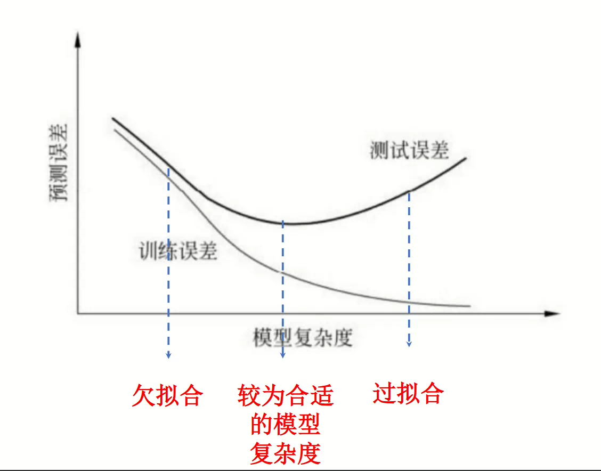
2. 增加训练数据来避免过拟合
3. 进行交叉验证来避免过拟合:在数据有限的情况下，**通过多次训练和测试，确保模型不会过度依赖某一部分数据**，从而提升泛化能力
   1. K折交叉验证：将数据集划分为 K 份，每次用 K-1 份训练，1 份测试，循环 K 次，最终计算所有测试结果的平均值。
   2. 留一法：每次仅用1个样本作为测试集，剩余数据作为训练集，循环进行。
4. 正则化：在损失函数中加入惩罚项，控制模型复杂度
   1. 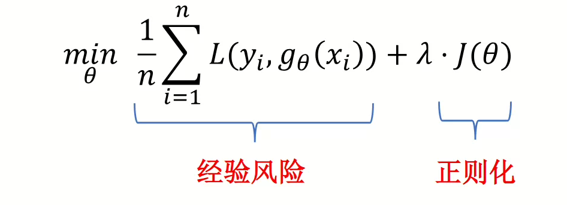
   2. L1正则化（Lasso）：惩罚所有参数绝对值的和，**避免过大参数值**.
   > 1. $J(\theta) = \sum_{t=1}^T{|\theta_t|}$
   > 2. 压缩模型大小、*特征选择*(将不重要的特征压缩为0)
   > 3. 适用于线性回归，逻辑回归
   3. L2正则化（Ridge）：惩罚所有参数平方和，*惩罚大参数值*
   > 1. $J(\theta) = \sum_{t=1}^T{(\theta_t)^2}$
   > 2. *让模型参数值更小、更均匀*，从而防止某些特征对模型的影响过大
##### 数据集如何划分？
1. 训练集：用于训练模型，调整参数
2. 验证集(Validation Set)：拥有$x_i$和$y_i$，用于**调优超参数和防止过拟合**。训练集上训练结束后再验证集上验证，判断模型拟合效果。若在测试集上调整超参数，可能会导致*数据泄漏（Data Leakage）*，影响模型的真实泛化能力！
3. 测试集：评估模型的最终性能以近似泛化误差
##### 性能评估
1. 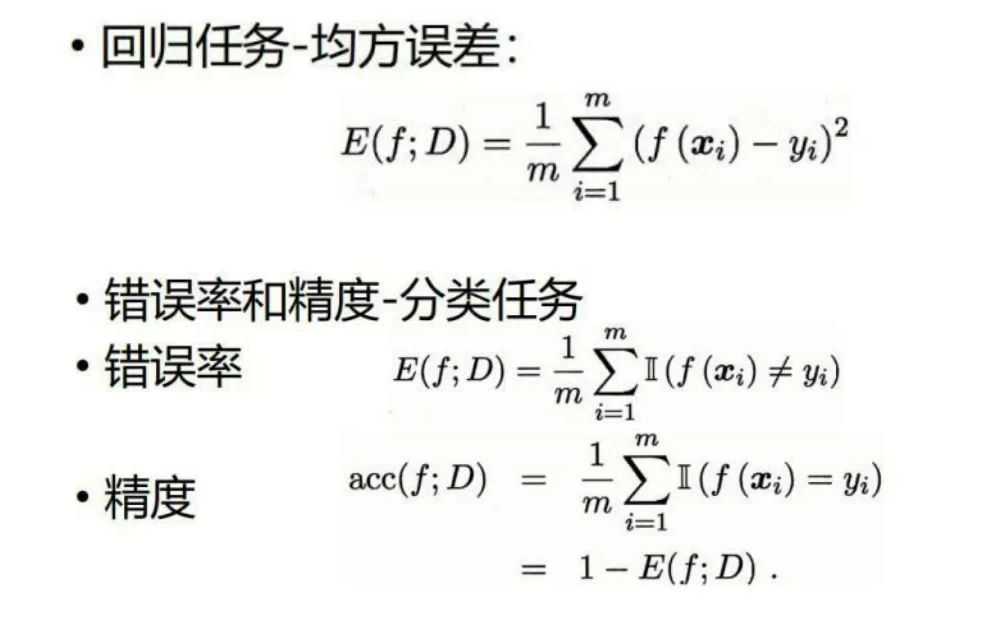
2. 查准率和查全率：
   1. 二分类混淆矩阵：TP（判断为真且实际为真），FP（判断为真但实际为假），TN(判断为假且实际为假)，FN（判断为假但实际为真）。
   2. 查准率：*在所有被模型预测为正类的样本中，实际为正类的比例.*反映了模型精确度。表示预测出来的垃圾邮件中，大多数确实是垃圾邮件。
   > $Precision = \frac{TP}{TP+FP}$
   3. 查全率：*所有实际为正类的样本中，模型成功预测出的比例*。反映了模型的覆盖能力。表示模型找出了大多数垃圾邮件.
   4. **P和R值相互制衡，P高则R低**
   > $Recall = \frac{TP}{TP+FN}$
3. $F_1$Score:
   1. *是查准率和查全率的调和平均值*。可以在PR之间找到一个平衡。
   2. $\frac{1}{F_1} = \frac{\frac{1}{Precision} + \frac{1}{Recall}}{2}$
   3. $F_1 = 2 × \frac{P + R}{P×R}$
   4. 为什么不用普通平均：*普通平均值不能反应极端值*，当R很高但P很低时，普通平均得到0.5，而调和平均值为0
4. $F_{\beta}$Score:
   1. 带权重的$F_1$，在Recall上乘以权重$\beta^2$，可以使任务更加具有倾向性
   2. $\frac{1}{F_{\beta}} = \frac{\frac{1}{Precision} + \frac{\beta^2}{Recall}}{1 + \beta^2}$
   3. $F_{\beta} = \frac{(1 + \beta^2)×Precision×Recall}{\beta^2 Precision + Recall}$ 
5. 偏差bias:$E(\hat{y}) - y$：衡量考虑所有训练集后的平均$\hat{y}$值和真实值之间的差距，**偏差表示了模型的拟合能力大小**。
6. 方差variance：$var = E((E(\hat{y}) - y)^2)$:衡量了考虑所有训练集后平均预测值和真实值之间平方差的平均值。方差表示了模型对不同数据集的*波动程度*，反映了**模型稳定性**。*方差越高，则训练集对于模型的影响越大，过拟合可能性越高*。
# 第三章 回归
回归问题要解决的问题是，找到一个数学模型，找到输入变量$X^T=[x_1,x_2,...,x_n]$和输出变量$y$之间的关系。即找到一个函数，使得$y = f(x_1,x_2,...,x_n)$
## 矩阵求导
https://zhuanlan.zhihu.com/p/288541909?utm_psn=1850512444943917056
## 线性回归
1. 输入变量$X$和输出变量$y$之间存在一个线性关系。$y = W^TX$,$W[w_1,w_2,...w_n]$,$X=[x_1,x_2,...,x_n]$
2. 线性回归参数推导：*最小均方误差*
   1.  目的是最小化**均方误差损失**：$R(w) = \frac{1}{2} × \sum_{i=1}^{n}(\hat{y_i}-y)^2 = \frac{1}{2} × \sum_{i=1}^{n}(W^TX-y)^2$
   2. 对参数$W$求导，使得损失函数最小化时，导数为0：
   > 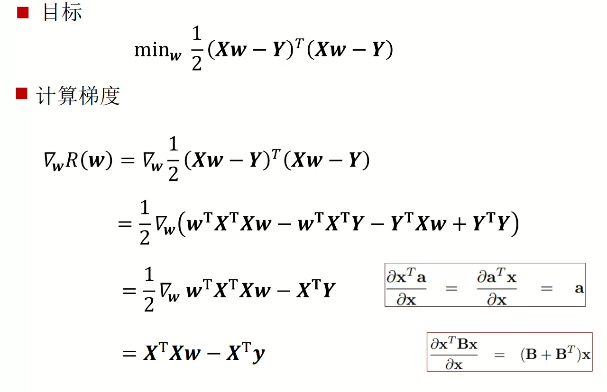
   > 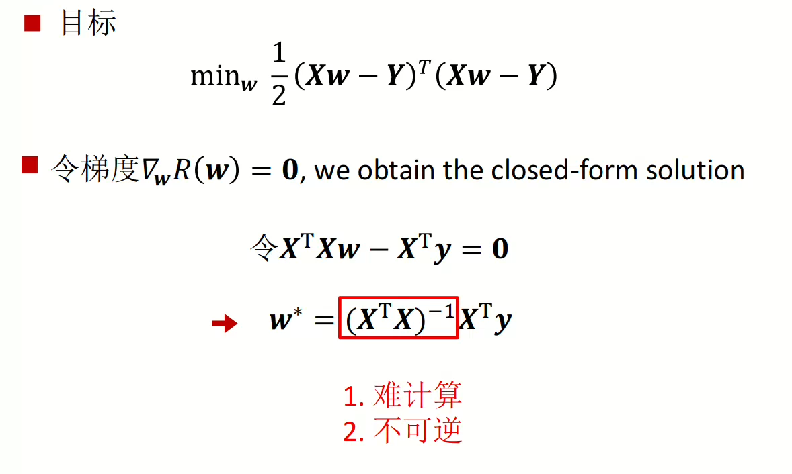
3. 线性回归参数推导：*岭回归*
   1. 岭回归是均方误差+$\frac{1}{2} ×\lambda × \sum_{i=1}^N(w_i)^2$，即增加一个参数惩罚项
   2. 标量对向量求导：$\frac{1}{2} ×\lambda × \sum_{i=1}^N(w_i)^2$之中，$\sum_{i=1}^N(w_i)^2$是一个标量函数，而对于向量$W$求导，结果是一个列向量，每一项都表示标量函数对向量对应分量的偏导数：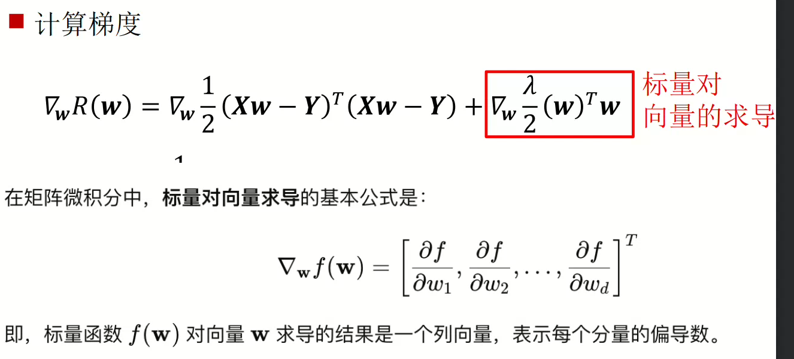
   3. 对参数$W$求导，并令其等于0
   > 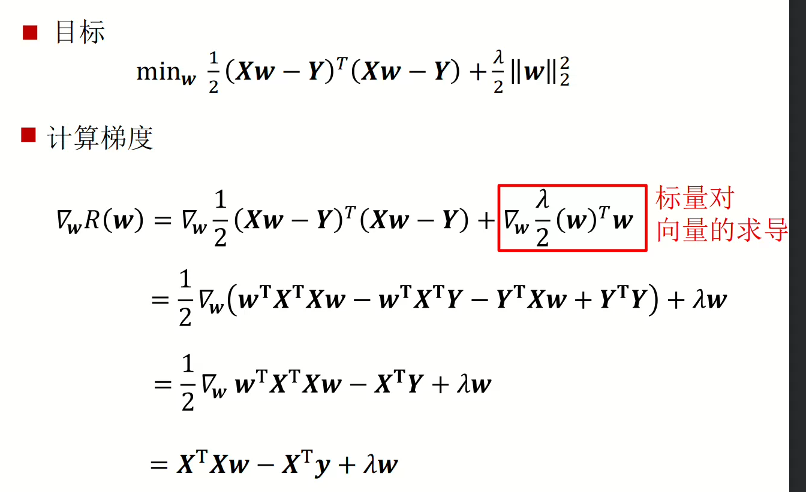
   > 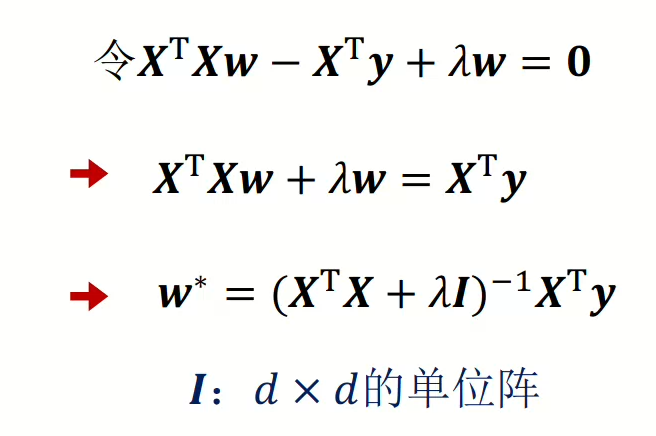
   4. $\lambda$越大，则参数权重越小，模型越简单。
4. 线性回归参数推导：*梯度下降法*,Gradient Descend, GD 
   1. 目的：为了寻找到$R(w)$损失函数的最小值，可以通过迭代算法，通过向数值降低速度最快的梯度方向前进，从而快速减少$R(w)$
   2. 梯度下降过程：
   > 1. 选取初始参数值$w_t=0,t=0$
   > 2. *计算当前点$t$的梯度值*$d = \Delta_{w}R(w)|_{w=w_t}$ 
   > 3. *向着梯度反方向走一个步长值*:$w_{t+1} = w_t - \alpha d$
   > 4. 重复2，3直到收敛
   3. 线性回归的梯度下降：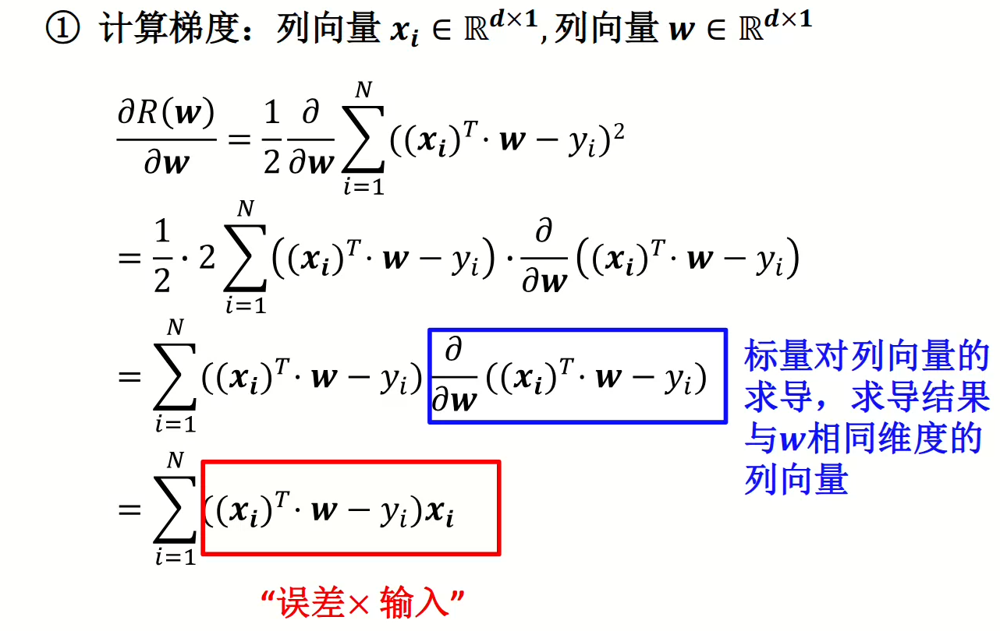
   4. *必须选择合适的步长*
5. 梯度下降不同种类：
   1. 批量梯度下降（Batch Gradient Descent，BGD）：每次都使用训练集中全部的数据进行梯度下降，效率较低，适合*小数据集*
   > $w_{t+1} = w_t - \alpha\sum_i^n(g_i)$,$g_i$表示第$i$个训练数据计算得到的梯度向量。
   2. 随机梯度下降（Stochastic Gradient Descent，SGD）：训练过程中，每条训练数据都直接进行梯度下降，过程十分噪声，可能会导致目标函数*波动大，不稳定*
   > $w_{t+1} = w_t - \alpha g_i$
   3. 小批量梯度下降：选取一个*mini batch*计算梯度和，再进行梯度下降。比较稳定，效率也高
   4.  > $w_{t+1} = w_t -\alpha \sum_i^{n'}(g_i)$,$n'$是一个小batch
6. 对数线性回归
   1. 选择线性回归结果$\hat{y}$的衍生物进行拟合，例如拟合$\ln(\hat{y}) = W^TX$,此时$\hat{y} = e^{W^TX}$
## 逻辑回归
### Sigmoid函数
1. 对于回归任务来说，*输出的是连续预测值*；对于分类问题来说，*输出的是离散类别值*。**通过给回归任务设定一个阈值，就可以做到分类。**例如$\hat{y}>E$是恶性肿瘤，$\hat{y}\leqE$是非恶性肿瘤，其中$E$是预测均值.**阈值很难设定，容易受到离群值影响**。
2. 为了让线性回归方法能够用于分类，*需要将模型的输出控制在[0,1]，即输出概率值*。使用Sigmoid函数实现：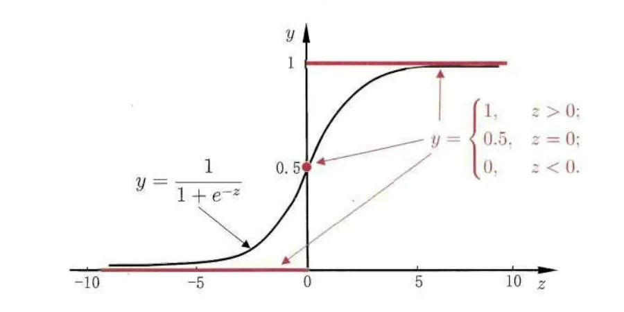
### 逻辑回归Logistic Regression
##### 交叉熵损失梯度下降法
虽说是“回归”，但实际上*解决二分类问题*，是*线性分类模型*
1. 使用一个线性决策面和一个sigmoid来预测概率。
2. 逻辑回归基本结构：
   1. 一个线性判别函数$f(W;X)=W^TX$
   2. 一个决策函数$g(f(W;X))=\{1 if f>0 or 0\}$，一般使用Sigmoid:$g(x) = \frac{1}{1 +e ^ {-x}}$
   3. 损失函数:交叉熵损失，可以衡量真实概率$p$和预测概率$q$之间的差异。$H(p,q)=-\sum_i{p_i \log q_i}$.越低越好。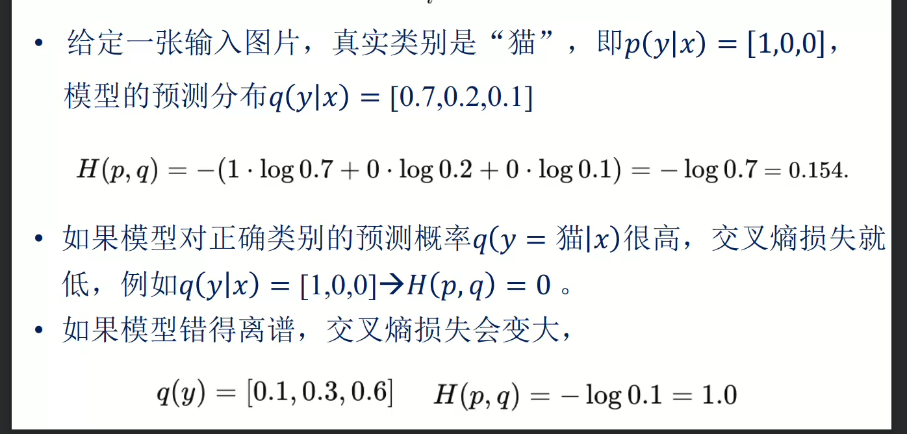.对于二分类的逻辑回归来说，$R(w) = -\frac{1}{N} × \sum_i^N({y_i\log{\hat{y_i}} + (1-y_i)\log{(1-\hat{y_i}})})$
3. 利用梯度下降来训练模型
   1. 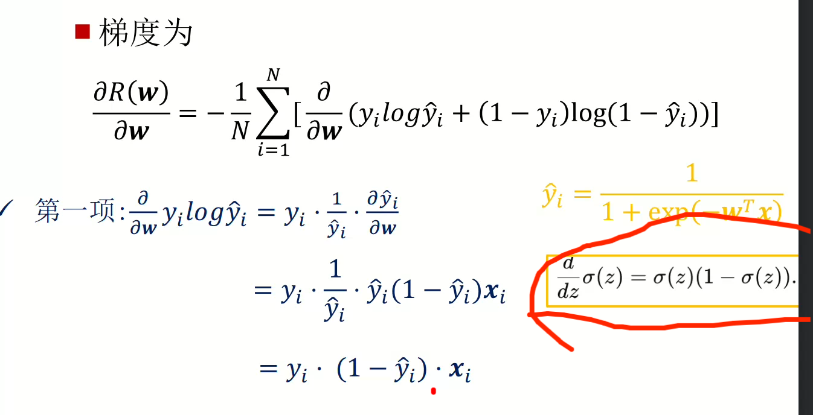
   2. 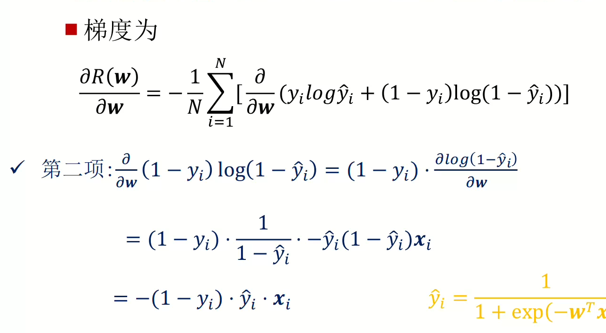
   3. 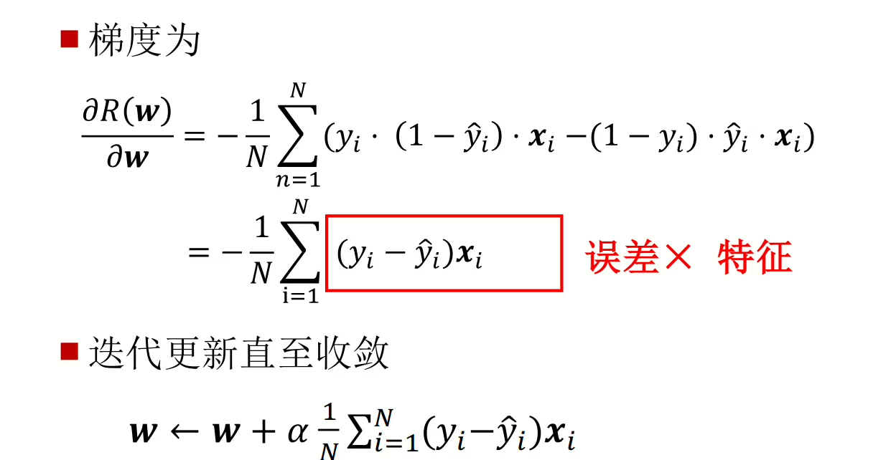
##### 最大似然估计（maximum likelihood estimation, MLE ）
1. 表示逻辑回归的概率：$y_i=1$表示正类，$y_i=0$表示负类。则有预测为正类的概率为$p_i$,负类概率为$1-p_i$，其中$p_i=sigmoid(W^TX)$则可以使用一个方程来同时表示正负类概率：$p = (p_i)^{y_i}×(1-p_i)^{1-y_i}$,若$y_i=1$，则$p=p_i$，若$y_i=0$，则$p=1-p_i$
2. MLE 的目标是最大化所有样本的联合概率.似然函数：$L(W) = \sum_i^N{((p_i)^{y_i}×(1-p_i)^{1-y_i})}，目的是最大化$L(W)$.**实际上，L(W)的负对数是和交叉熵损失等价的**。
3. 是一个无约束优化问题，可以使用
   1. 梯度上升法：求梯度时，可以求解$log(L(w))$对于$W$的梯度，更加方便，求出来和交叉熵损失的梯度一致，*是误差×特征*。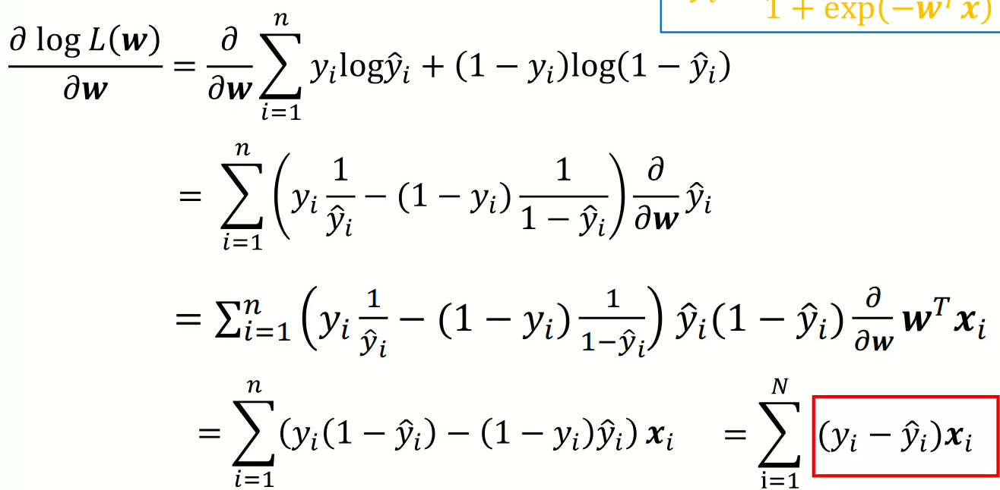。
   之后向梯度正方向走，想办法增大似然函数值。
   > 可以选择随机梯度下降/批量梯度下降/小批量梯度下降。**最好选择小批量梯度下降**
   2. 牛顿法：一种*二阶优化算法*，用于求解无约束优化问题+求解非线性方程。
   > 1. 首先为了近似出函数$f(\theta)$在$\thata_0$上的值，对$f(\theta)$求一个e二阶泰勒展开，利用*梯度和 Hessian 矩阵(表示了曲率)来求解*。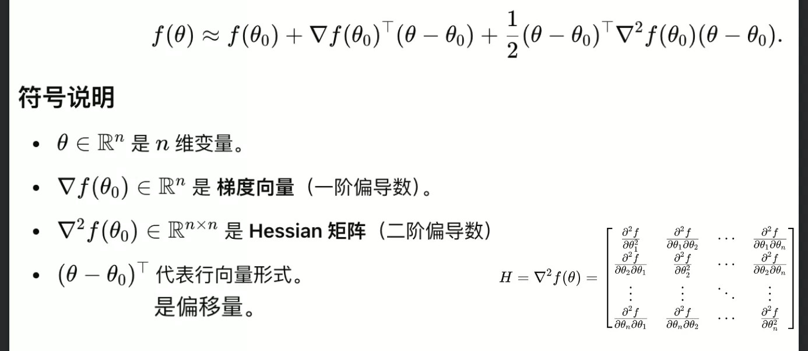
   > 2. 令$f(\theta)$的二阶泰勒展开的梯度=0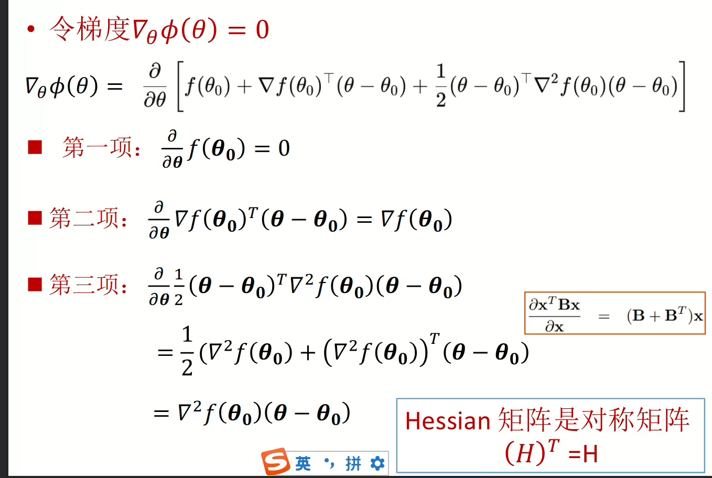